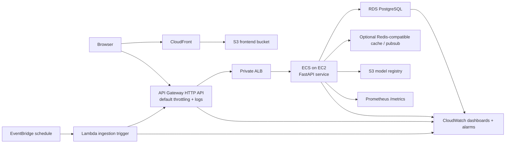

# NHL Draft Simulator 2025


A full-stack NHL draft product that combines lottery simulation, a pick-by-pick draft engine, GM tendency modeling, ML-based prospect ranking, streamed AI analysis, and AWS-backed production infrastructure.

## What This Project Demonstrates

- End-to-end product engineering: React frontend, FastAPI backend, PostgreSQL data model, CI/CD, and AWS infrastructure
- Applied ML: XGBoost LambdaMART ranking, temporal backtesting, baseline comparisons, calibration, and SHAP explainability
- AI product integration: streamed Scout chat and draft summaries grounded in your live database tools
- Production-minded engineering: API Gateway throttling, custom domains and TLS, ECS deploys, Route 53, CloudFront, CloudWatch, Prometheus, budgets, and operational runbooks

## Architecture



### Request Flow

1. CloudFront serves the React SPA from S3 over HTTPS.
2. The frontend calls the public API entrypoint for normal JSON requests.
3. API Gateway applies logging and throttling, then forwards traffic into the VPC.
4. A private ALB routes traffic to the FastAPI service running on ECS.
5. The backend reads/writes to PostgreSQL, can use a Redis-compatible cache/pub-sub layer for stream fan-out, and loads model artifacts from S3.
6. EventBridge triggers a Lambda daily, which calls the ingestion/admin API to refresh the data pipeline.

## Product Surface

### Frontend

- [HomePage.tsx](/Users/mihirdiatha/Desktop/Projects/NHL draft project/nhl-draft-simulator/frontend/src/pages/HomePage.tsx): guided entry flow that runs the lottery and draft simulation
- [LotteryPage.tsx](/Users/mihirdiatha/Desktop/Projects/NHL draft project/nhl-draft-simulator/frontend/src/pages/LotteryPage.tsx): live standings, lottery odds, and draw UI
- [DraftPage.tsx](/Users/mihirdiatha/Desktop/Projects/NHL draft project/nhl-draft-simulator/frontend/src/pages/DraftPage.tsx): 32-pick board, streamed analysis, SHAP drawer, and calibrated confidence labels
- [ProspectsPage.tsx](/Users/mihirdiatha/Desktop/Projects/NHL draft project/nhl-draft-simulator/frontend/src/pages/ProspectsPage.tsx): searchable/filterable prospect explorer
- [TeamPage.tsx](/Users/mihirdiatha/Desktop/Projects/NHL draft project/nhl-draft-simulator/frontend/src/pages/TeamPage.tsx): GM tendency and historical drafting behavior
- [ScoutPage.tsx](/Users/mihirdiatha/Desktop/Projects/NHL draft project/nhl-draft-simulator/frontend/src/pages/ScoutPage.tsx): streamed AI Scout chat with draft context
- [ModelPage.tsx](/Users/mihirdiatha/Desktop/Projects/NHL draft project/nhl-draft-simulator/frontend/src/pages/ModelPage.tsx): model status, baseline comparisons, and multi-year backtesting
- [AdminPage.tsx](/Users/mihirdiatha/Desktop/Projects/NHL draft project/nhl-draft-simulator/frontend/src/pages/AdminPage.tsx): ingestion and model operations

### Backend

- [main.py](/Users/mihirdiatha/Desktop/Projects/NHL draft project/nhl-draft-simulator/backend/app/main.py): FastAPI app factory, middleware, metrics, health/readiness probes
- [lottery.py](/Users/mihirdiatha/Desktop/Projects/NHL draft project/nhl-draft-simulator/backend/app/api/lottery.py): lottery odds and simulation
- [draft_sim.py](/Users/mihirdiatha/Desktop/Projects/NHL draft project/nhl-draft-simulator/backend/app/api/draft_sim.py): draft simulation, structured analysis, and streamed summary
- [teams_ext.py](/Users/mihirdiatha/Desktop/Projects/NHL draft project/nhl-draft-simulator/backend/app/api/teams_ext.py): team and GM tendency profiles
- [prospects.py](/Users/mihirdiatha/Desktop/Projects/NHL draft project/nhl-draft-simulator/backend/app/api/prospects.py): prospect browsing/filtering APIs
- [ml.py](/Users/mihirdiatha/Desktop/Projects/NHL draft project/nhl-draft-simulator/backend/app/api/ml.py): training, status, scoring, explainability, backtests, calibration, drift, and model history
- [agent.py](/Users/mihirdiatha/Desktop/Projects/NHL draft project/nhl-draft-simulator/backend/app/api/agent.py): Scout chat, streamed token delivery, history, and index operations
- [admin.py](/Users/mihirdiatha/Desktop/Projects/NHL draft project/nhl-draft-simulator/backend/app/api/admin.py): ingestion and maintenance APIs
- [standings.py](/Users/mihirdiatha/Desktop/Projects/NHL draft project/nhl-draft-simulator/backend/app/api/standings.py): live standings and live lottery odds

## ML System

The ranking model is trained on historical draft behavior and scores the prospects still on the board for each team and pick.

### Core Files

- [features.py](/Users/mihirdiatha/Desktop/Projects/NHL draft project/nhl-draft-simulator/backend/app/ml/features.py): feature engineering
- [train.py](/Users/mihirdiatha/Desktop/Projects/NHL draft project/nhl-draft-simulator/backend/app/ml/train.py): XGBoost LambdaMART training pipeline
- [predict.py](/Users/mihirdiatha/Desktop/Projects/NHL draft project/nhl-draft-simulator/backend/app/ml/predict.py): scoring pipeline
- [backtest.py](/Users/mihirdiatha/Desktop/Projects/NHL draft project/nhl-draft-simulator/backend/app/ml/backtest.py): held-out evaluation, baseline benchmarks, and multi-year reporting
- [calibration.py](/Users/mihirdiatha/Desktop/Projects/NHL draft project/nhl-draft-simulator/backend/app/ml/calibration.py): conformal calibration
- [explain.py](/Users/mihirdiatha/Desktop/Projects/NHL draft project/nhl-draft-simulator/backend/app/ml/explain.py): SHAP explainability
- [registry.py](/Users/mihirdiatha/Desktop/Projects/NHL draft project/nhl-draft-simulator/backend/app/ml/registry.py): hot reloadable model registry

### Evaluation Highlights

- Temporal backtests: train on prior years, evaluate on held-out years
- Baseline comparisons against:
  - CSS best-available
  - PPG best-available
  - uniform random
- Multi-year consistency reporting across multiple draft classes
- Calibration metadata exposed to the UI so picks can be marked as high-confidence vs volatile

For a deeper overview, see [MODEL_CARD.md](/Users/mihirdiatha/Desktop/Projects/NHL draft project/nhl-draft-simulator/docs/MODEL_CARD.md).

## AI Layer

The Scout experience is a grounded assistant, not a generic chatbot.

- [scout.py](/Users/mihirdiatha/Desktop/Projects/NHL draft project/nhl-draft-simulator/backend/app/agent/scout.py): orchestrates tool use and streamed response generation
- [tools.py](/Users/mihirdiatha/Desktop/Projects/NHL draft project/nhl-draft-simulator/backend/app/agent/tools.py): database-backed tool definitions
- [store.py](/Users/mihirdiatha/Desktop/Projects/NHL draft project/nhl-draft-simulator/backend/app/agent/store.py): retrieval and persistence
- [pubsub.py](/Users/mihirdiatha/Desktop/Projects/NHL draft project/nhl-draft-simulator/backend/app/agent/pubsub.py): Redis-backed stream fan-out for scalable SSE delivery
- [memory.py](/Users/mihirdiatha/Desktop/Projects/NHL draft project/nhl-draft-simulator/backend/app/agent/memory.py): history summarization for long conversations

The frontend consumes streamed responses via `ReadableStream` on:

- [ScoutPage.tsx](/Users/mihirdiatha/Desktop/Projects/NHL draft project/nhl-draft-simulator/frontend/src/pages/ScoutPage.tsx)
- [DraftPage.tsx](/Users/mihirdiatha/Desktop/Projects/NHL draft project/nhl-draft-simulator/frontend/src/pages/DraftPage.tsx)

## Infrastructure

Terraform lives in [/infrastructure/terraform](/Users/mihirdiatha/Desktop/Projects/NHL draft project/nhl-draft-simulator/infrastructure/terraform).

### AWS Services In Use

- CloudFront + S3 for frontend delivery
- Route 53 + ACM for optional custom domains and TLS
- API Gateway HTTP API as the public JSON API entrypoint
- API Gateway throttling instead of WAF for low-cost edge protection
- ECS on EC2 for the FastAPI runtime
- Private ALB inside the VPC for service routing
- RDS PostgreSQL for the primary data store
- S3 for model artifacts and rollback
- Secrets Manager + SSM Parameter Store for configuration and secrets
- EventBridge + Lambda for scheduled ingestion
- CloudWatch + SNS for logs, alarms, dashboards, and notifications
- AWS Budgets for low-cost spend alerting

## CI/CD

CI/CD is implemented in [ci.yml](/Users/mihirdiatha/Desktop/Projects/NHL draft project/nhl-draft-simulator/.github/workflows/ci.yml).

### CI

On pushes and pull requests to `main`, GitHub Actions runs:

- backend linting and unit tests
- backend integration tests with `testcontainers`
- Alembic migration checks
- Terraform validate
- Terraform plan with AWS OIDC auth
- Docker image build validation

### CD

On pushes to `main`, GitHub Actions:

1. Builds and pushes the backend image to ECR
2. Runs Alembic migrations as an ECS task
3. Rolls the ECS service forward
4. Runs backend smoke tests against `/livez`, `/readyz`, and `/api/ml/status`
5. Builds the frontend, uploads it to S3, and invalidates CloudFront
6. Runs a frontend smoke test if `FRONTEND_URL` is configured
7. Updates the scheduled ingestion Lambda

AWS auth is handled via OIDC and IAM roles, so no long-lived deploy keys are stored in GitHub.

## Quick Start

```bash
git clone https://github.com/your-org/nhl-draft-simulator
cd nhl-draft-simulator

cp backend/.env.example backend/.env
docker compose up -d

cd backend
alembic upgrade head
python -m app.ingestion.nhl_api

cd ../frontend
npm install
npm run dev
```

Open `http://localhost:5173`

## Operational Docs

- [APP_SUMMARY.md](/Users/mihirdiatha/Desktop/Projects/NHL draft project/nhl-draft-simulator/docs/APP_SUMMARY.md)
- [MODEL_CARD.md](/Users/mihirdiatha/Desktop/Projects/NHL draft project/nhl-draft-simulator/docs/MODEL_CARD.md)
- [OPERATIONS.md](/Users/mihirdiatha/Desktop/Projects/NHL draft project/nhl-draft-simulator/docs/OPERATIONS.md)

## Resume-Friendly Summary

Built a full-stack NHL Draft Simulator with React, FastAPI, Terraform, and AWS infrastructure; deployed the frontend via CloudFront/S3 and the backend via API Gateway, ECS, RDS, and CloudWatch; implemented an XGBoost LambdaMART ranking pipeline with SHAP explainability, baseline benchmarking, and multi-year backtesting; and added streamed AI scouting workflows grounded in live draft data.
